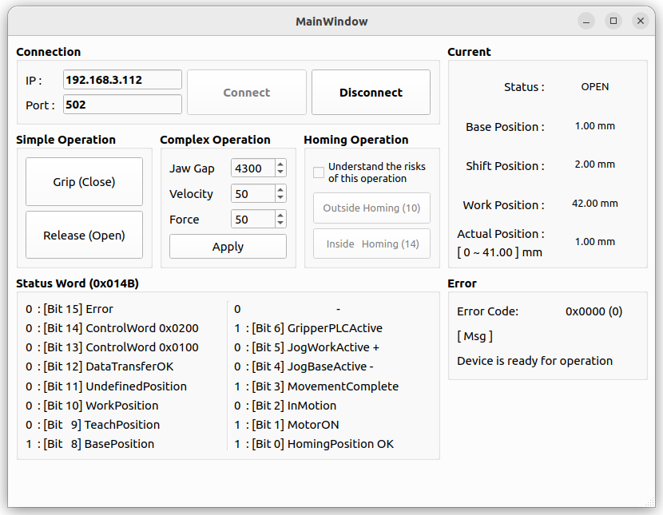
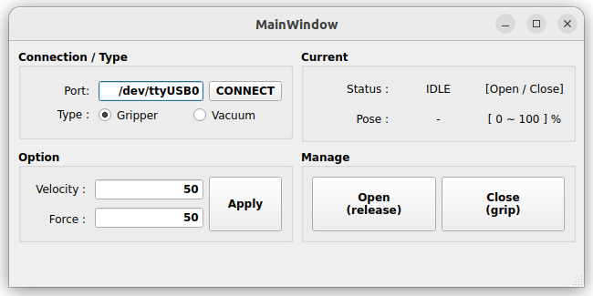

# Gripper Manager

## 📁 Project Structure

```
Gripper_manager/
├── console_colors.py               # Console color constants for terminal output
├── docker-compose.yml              # Docker Compose configuration
├── Dockerfile                      # Docker build configuration
├── koras.py                        # KORAS gripper control module
├── koras_window.py / .ui           # KORAS window implementation (Python, UI)
├── manage.sh                       # Docker management & run script
├── pyproject.toml                  # Python project configuration
├── uv.lock                         # uv dependency lock file
├── zimmer.py                       # Zimmer gripper control module
├── zimmer_window.py / .ui          # Zimmer window implementation (Python, UI)
└── README.md                       # Project documentation
```

## 🔧 Environment

### 🐳 Docker (Recommend)

<details>
<summary>Setup Guide (Volume Shared)</summary>

#### 1. Build Docker Image

```bash
docker build -t project:gripper-manager -f Dockerfile .
```

#### 2. Run Docker Container using Docker compose

```bash
cd /Gripper_manager
./manage.sh [COMMAND]
```

> ### Options
>
> | Command   | Description                             |
> | --------- | --------------------------------------- |
> | `zimmer ` | 🤖 Run Zimmer Gripper Manager GUI       |
> | `koras`   | 🤖 Run KORAS Gripper Manager GUI        |
> | -         |                                         |
> | `start`   | 🟢 Start Docker Container               |
> | `stop`    | 🔴 Stop Docker Container                |
> | `restart` | 🔄 Restart Docker Container             |
> | `logs`    | 📋 Check Docker Logs                    |
> | `status`  | 📊 Check Container Status               |
> | `shell`   | 🐚 Access Docker Container (bash shell) |
> | `exit`    | ❌ Exit                                 |

</details>

### 🐍 Local

<details>
<summary>Setup Guide</summary>

- Virtual environment using uv

  ```bash
  # Install uv (recommended for faster package management)
  curl -LsSf https://astral.sh/uv/install.sh | sh

  # Sync Dependencies (from lock file)
  uv sync --frozen
  ```

  > **NOTE:** Automatically create a `.venv` directory and install dependencies based on `pyproject.toml` / `uv.lock`.

  > **NOTE:** In VSCode, set `python.defaultInterpreterPath` to `${workspaceFolder}/.venv/bin/python` for proper IntelliSense and debugging.

- Global environmnet using Using uv

  ```bash
  uv export --frozen -o requirements.lock.txt
  sudo uv pip install --system -r requirements.lock.txt
  ```

- Global environmnet using pip directly

  ```bash
  pip install --upgrade pip
  pip install PySide6
  pip install pymodbus==3.6.9
  ```

</details>

## 🚀 Usage

### 🐳 Docker (Recommend)

#### 1. Start Services

```bash
# Start all services in background
./manage.sh start
```

#### 2. Run Application

```bash
# Run the GUI application
./docker-run.sh zimmer
./docker-run.sh koras
```

### 🐍 Python

#### 1. Run Application Manually

```bash
# Run manually (outside Docker)
uv run python zimmer_window.py
uv run python koras_window.py
```

## ✨ Main Features

- **Gripper Connection/Disconnection**: Modbus TCP/IP-based gripper communication
- **Zimmer Gripper Control**: Support for 2-finger and 3-finger Zimmer grippers
- **Real-time Control**: Grip/Release operations with position feedback
- **Position Monitoring**: Real-time gripper jaw position display
- **Force & Velocity Control**: Adjustable gripper force and movement speed
- **Multi-step Communication**: Robust handshake protocol for reliable operation
- **GUI Interface**: PySide6-based intuitive control interface

## ⚙️ Configuration

### 1. Dependencies

- **Python 3.10**: Base runtime environment
- **PySide6**: Qt6-based GUI framework for Python
- **pymodbus 3.6.9**: Modbus TCP/IP communication library
- **Modbus TCP/IP**: Communication protocol for gripper control
- **Docker & Docker Compose**: Containerized development environment

## 📝 Notes

- Ensure gripper is powered on and network accessible
- X11 forwarding must be enabled for GUI in Docker

## 🖥️ Screen Shot

- Zimmer GUI

  

- KORAS GUI

  
