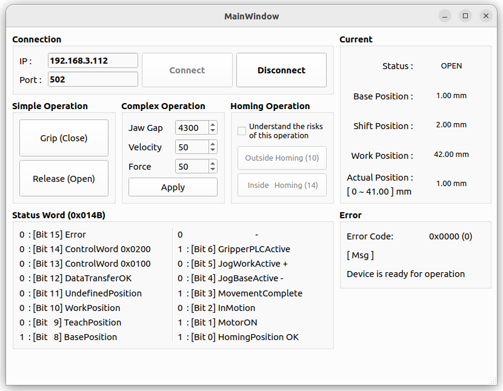
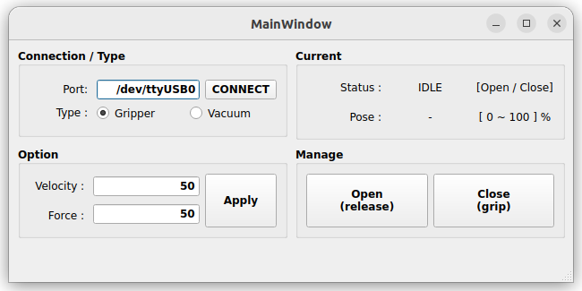

# Gripper Manager

**Modbus TCP/IP 및 RTU 기반 산업용 그리퍼 제어 시스템**

[]()
[]()
[]()
[](LICENSE)

---

## 목차

- [데모](#데모)
- [개요](#개요)
- [주요 기능](#주요-기능)
- [시스템 구조](#시스템-구조)
- [프로젝트 구조](#프로젝트-구조)
- [빠른 시작](#빠른-시작)
- [시스템 요구사항](#시스템-요구사항)
- [설치](#설치)
- [실행](#실행)
- [사용법](#사용법)
- [설정](#설정)
- [문제 해결](#문제-해결)
- [라이선스](#라이선스)
- [Maintainer](#maintainer)

---

## 데모

<details>
<summary>데모 보기</summary>

### Zimmer 그리퍼 GUI



### KORAS 그리퍼 GUI



</details>

---

## 개요

### 프로젝트 목적

다양한 산업용 그리퍼를 Modbus 프로토콜로 통합 제어하는 PySide6 기반 GUI 애플리케이션입니다. 그리퍼의 위치, 힘, 속도를 실시간으로 제어하고 상태를 모니터링할 수 있습니다.

### 주요 구성요소

- **zimmer.py / zimmer_window.py** (Python): Zimmer 2/3핑거 그리퍼 Modbus TCP/IP 제어 모듈 및 GUI
- **koras.py / koras_window.py** (Python): KORAS 모터 구동 그리퍼 Modbus RTU 제어 모듈 및 GUI
- **egh.py** (Python): SCHUNK EGH IO-Link 그리퍼 Modbus TCP/IP 어댑터 제어 (CLI)

### 적용 가능 영역

- 산업용 로봇 그리퍼 제어 및 자동화
- 그리퍼 테스트 및 디버깅
- 연구개발 및 교육

---

## 주요 기능

- **Zimmer 그리퍼 제어**: GEH6060IL, GEH6040IL (2핑거) / GED6060IL, GED6040IL (3핑거) 지원, 8단계 핸드셰이크 프로토콜
- **KORAS 그리퍼 제어**: Modbus RTU 시리얼 통신 기반 모터 구동 그리퍼, 진공 그리퍼 지원
- **SCHUNK EGH 제어**: IO-Link 마스터를 통한 Modbus TCP/IP 어댑터 기반 제어 (CLI)
- **실시간 GUI 모니터링**: PySide6 기반 위치/상태 실시간 표시 (100ms 갱신)
- **위치/힘/속도 제어**: 세밀한 파라미터 조정 (위치 0.01mm 단위, 힘/속도 0-100%)
- **진단 기능**: 상태 워드 시각화, 에러 코드 및 진단 메시지 표시
- **Docker 지원**: 빌드 및 실행 스크립트 포함, 원클릭 컨테이너 환경

---

## 시스템 구조

```
┌─────────────────────────────────────────────────────────────┐
│                      PySide6 GUI Layer                      │
│  ┌──────────────────┐  ┌──────────────────┐                 │
│  │  zimmer_window   │  │  koras_window    │                 │
│  └────────┬─────────┘  └────────┬─────────┘                 │
└───────────┼──────────────────────┼──────────────────────────┘
            │                      │
┌───────────┼──────────────────────┼──────────────────────────┐
│           ▼                      ▼              Python      │
│  ┌──────────────┐  ┌──────────────┐  ┌──────────────┐       │
│  │   zimmer.py  │  │   koras.py   │  │    egh.py    │       │
│  │   (TCP/IP)   │  │    (RTU)     │  │   (TCP/IP)   │       │
│  └──────┬───────┘  └──────┬───────┘  └──────┬───────┘       │
└─────────┼──────────────────┼─────────────────┼──────────────┘
          │                  │                 │
  ┌───────▼───────┐  ┌──────▼──────┐  ┌───────▼───────┐
  │ Modbus TCP/IP │  │ Modbus RTU  │  │ Modbus TCP/IP │
  │  (Ethernet)   │  │ (USB Serial)│  │  (Ethernet)   │
  └───────┬───────┘  └──────┬──────┘  └───────┬───────┘
          │                  │                 │
  ┌───────▼───────┐  ┌──────▼──────┐  ┌───────▼───────┐
  │ Zimmer Gripper│  │KORAS Gripper│  │ IO-Link Master│
  │ (2/3-Finger)  │  │   (Motor)   │  │ → SCHUNK EGH  │
  └───────────────┘  └─────────────┘  └───────────────┘
```

---

## 프로젝트 구조

```
Gripper_manager/
├── zimmer.py              # Zimmer 그리퍼 Modbus TCP/IP 제어 모듈
├── zimmer_window.py       # Zimmer 그리퍼 GUI 애플리케이션
├── zimmer_window.ui       # Zimmer GUI 레이아웃 (Qt Designer)
├── zimmer_config.json     # Zimmer 연결 설정 (자동 생성)
├── koras.py               # KORAS 그리퍼 Modbus RTU 제어 모듈
├── koras_window.py        # KORAS 그리퍼 GUI 애플리케이션
├── koras_window.ui        # KORAS GUI 레이아웃 (Qt Designer)
├── egh.py                 # SCHUNK EGH IO-Link 그리퍼 제어 (CLI)
├── console_colors.py      # 터미널 출력 색상 상수
├── pyproject.toml         # Python 프로젝트 설정
├── uv.lock                # uv 의존성 잠금 파일
├── .python-version        # Python 버전 지정 (3.10)
├── docker/
│   ├── Dockerfile         # Docker 이미지 빌드 설정
│   ├── build.sh           # Docker 이미지 빌드 스크립트
│   ├── run.sh             # Docker 컨테이너 실행 스크립트
│   ├── config.sh          # Docker 설정 (이미지/컨테이너 이름)
│   └── config.sh.example  # Docker 설정 템플릿
├── docs/
│   ├── zimmer_gui.png     # Zimmer GUI 스크린샷
│   └── koras_gui.png      # KORAS GUI 스크린샷
└── README.md
```

---

## 빠른 시작

### Option 1: Docker (권장)

```bash
# 1. Docker 이미지 가져오기
docker pull hhanoo/project:gripper-manager

# 2. 컨테이너 실행 (X11 포워딩 포함)
cd Gripper_manager/docker
./run.sh

# 3. 컨테이너 내부에서 실행
python3 zimmer_window.py    # Zimmer 그리퍼 GUI
python3 koras_window.py     # KORAS 그리퍼 GUI
```

### Option 2: Native

```bash
# 0. 프로젝트 루트로 이동
cd Gripper_manager

# 1. 의존성 설치 (uv 사용)
uv sync --frozen

# 2. 실행
uv run python zimmer_window.py    # Zimmer 그리퍼 GUI
uv run python koras_window.py     # KORAS 그리퍼 GUI
```

---

## 시스템 요구사항

### 필수

| 항목 | 요구사항              |
| ---- | --------------------- |
| OS   | Ubuntu 20.04+ (Linux) |
| 언어 | Python 3.10+          |

### 하드웨어

| 항목              | 사양         | 비고             |
| ----------------- | ------------ | ---------------- |
| Ethernet          | 100Mbps 이상 | Zimmer, EGH 연결 |
| USB 시리얼 어댑터 | /dev/ttyUSB0 | KORAS 연결       |

### 외부 패키지

| 패키지   | 버전    | 용도                    |
| -------- | ------- | ----------------------- |
| pymodbus | 3.6.9   | Modbus TCP/IP, RTU 통신 |
| PySide6  | 6.10.0+ | Qt6 GUI 프레임워크      |

---

## 설치

### Method 1: Docker (권장)

```bash
# 1. Docker 이미지 가져오기
docker pull hhanoo/project:gripper-manager

# 2. 컨테이너 실행
cd Gripper_manager/docker
./run.sh
```

<details>
<summary>직접 빌드 (개발자용)</summary>

```bash
# 0. 프로젝트 루트로 이동
cd Gripper_manager/docker

# 1. 설정 파일 생성 후 IMAGE_NAME을 로컬 이름으로 변경
cp config.sh.example config.sh
# config.sh에서 IMAGE_NAME="gripper-manager" 로 수정

# 2. Docker 이미지 빌드
./build.sh

# 3. 컨테이너 실행
./run.sh
```

</details>

### Method 2: Native

#### 1. 저장소 클론

```bash
git clone <repository-url>
cd Gripper_manager
```

#### 2. uv 설치 (미설치 시)

```bash
curl -LsSf https://astral.sh/uv/install.sh | sh
```

#### 3. 의존성 설치

```bash
uv sync --frozen
```

---

## 실행

### Zimmer 그리퍼 GUI

```bash
# Docker 컨테이너 내부
python3 zimmer_window.py

# Native (uv)
uv run python zimmer_window.py
```

### KORAS 그리퍼 GUI

```bash
# Docker 컨테이너 내부
python3 koras_window.py

# Native (uv)
uv run python koras_window.py
```

### SCHUNK EGH (CLI)

```bash
# 초기화
python3 egh.py --ip 192.168.3.113 --port 502 --action init

# 그립 (폭 0%)
python3 egh.py --ip 192.168.3.113 --action grip --width 0

# 릴리즈 (폭 100%)
python3 egh.py --ip 192.168.3.113 --action release --width 100

# 상태 확인
python3 egh.py --ip 192.168.3.113 --action status
```

---

## 사용법

### Zimmer 그리퍼

```
네트워크 확인 ─────▶ GUI 실행 ─────▶ 연결 ─────▶ 제어
      │                  │              │            │
 ping 확인        zimmer_window    IP/Port 입력   Init/Open/Close
```

1. 그리퍼 네트워크 연결 확인: `ping 192.168.3.112`
2. `zimmer_window.py` 실행
3. IP (`192.168.3.112`), Port (`502`) 입력 후 Connect
4. Init 버튼으로 초기화 (홈잉)
5. Open/Close 또는 Jaw Gap 입력 후 Custom Position으로 제어
6. Force/Velocity 슬라이더로 파라미터 조정

### KORAS 그리퍼

```
시리얼 포트 확인 ──▶ GUI 실행 ─────▶ 연결 ─────▶ 제어
      │                  │              │            │
 ls /dev/ttyUSB*   koras_window    포트/모드 선택  Open/Close
```

1. 시리얼 포트 확인: `ls /dev/ttyUSB*`
2. 포트 권한 설정 (필요 시): `sudo chmod 666 /dev/ttyUSB0`
3. `koras_window.py` 실행
4. 시리얼 포트 입력, 그리퍼/진공 모드 선택 후 연결
5. Open/Close 버튼으로 제어, Velocity/Force 설정

---

## 설정

### zimmer_config.json

Zimmer GUI 연결 설정이 자동 저장됩니다.

```json
{
  "ip": "192.168.3.112",
  "port": "502",
  "jaw_gap": "4300",
  "velocity": "50",
  "force": "50"
}
```

| 파라미터 | 기본값        | 설명                  |
| -------- | ------------- | --------------------- |
| ip       | 192.168.3.112 | 그리퍼 IP 주소        |
| port     | 502           | Modbus TCP 포트       |
| jaw_gap  | 4300          | 조 간격 (0.01mm 단위) |
| velocity | 50            | 구동 속도 (0-100%)    |
| force    | 50            | 그립 힘 (0-100%)      |

### KORAS 시리얼 설정

| 파라미터  | 기본값       | 설명               |
| --------- | ------------ | ------------------ |
| port      | /dev/ttyUSB0 | 시리얼 포트        |
| baudrate  | 38400        | 통신 속도 (bps)    |
| data bits | 8            | 데이터 비트        |
| stop bits | 1            | 스톱 비트          |
| parity    | None         | 패리티             |
| slave_id  | 1            | Modbus 슬레이브 ID |

### Docker 설정

[config.sh](docker/config.sh.example)

```bash
IMAGE_NAME="hhanoo/project:gripper-manager"  # Docker Hub 이미지 (기본값)
CONTAINER_NAME="gripper-manager"             # Docker 컨테이너 이름
```

> `run.sh` 실행 전 `docker pull hhanoo/project:gripper-manager`로 이미지를 가져오세요.  
> 직접 빌드하려면 `IMAGE_NAME`을 `"gripper-manager"` 등으로 변경 후 `./build.sh`를 실행하세요.

---

## 문제 해결

### 1. Zimmer/EGH 그리퍼 연결 실패

증상:

```
Connection refused / Timeout
```

해결:

```bash
# 네트워크 연결 확인
ping 192.168.3.112

# Modbus 포트 확인
nc -zv 192.168.3.112 502

# 방화벽 확인
sudo ufw status
```

### 2. KORAS 시리얼 포트를 찾을 수 없음

증상:

```
/dev/ttyUSB0: No such file or directory
```

해결:

```bash
# USB 장치 확인
ls /dev/ttyUSB*

# USB 연결 로그 확인
dmesg | tail -20
```

### 3. KORAS 시리얼 포트 권한 오류

증상:

```
Permission denied: '/dev/ttyUSB0'
```

해결:

```bash
# 임시 해결
sudo chmod 666 /dev/ttyUSB0

# 영구 해결 (dialout 그룹 추가 후 재로그인)
sudo usermod -aG dialout $USER
```

### 4. Docker에서 GUI가 표시되지 않음

증상:

```
qt.qpa.xcb: could not connect to display
```

해결:

```bash
# X11 포워딩 허용
xhost +local:docker

# DISPLAY 환경변수 확인
echo $DISPLAY

# run.sh 사용 (자동 X11 설정 포함)
cd docker && ./run.sh
```

### 5. PySide6 xcb plugin 오류

증상:

```
qt.qpa.plugin: Could not load the Qt platform plugin "xcb"
```

해결:

```bash
# 필요한 XCB 라이브러리 설치 (Docker 외부 실행 시)
sudo apt install -y \
  libxcb-xinerama0 \
  libxcb-cursor0 \
  libxkbcommon-x11-0
```

### 6. Docker 컨테이너에서 디바이스 접근 불가

증상:

```
Failed to open /dev/ttyUSB0
```

해결:

```bash
# run.sh는 --privileged 및 -v /dev:/dev:rw 옵션 포함
# 수동 실행 시 해당 옵션 추가 필요
docker run --privileged -v /dev:/dev:rw ...
```

---

## 라이선스

이 프로젝트는 Apache License 2.0으로 배포됩니다. 자세한 내용은 [LICENSE](LICENSE) 파일을 참조하세요.

---

## Maintainer

hhanoo (woo980711@gmail.com)
